# WhiteNeedle 新手使用指南

本指南面向首次使用 WhiteNeedle 的开发者，假设你对 VS Code / Cursor 有基本了解，但从未使用过 iOS 运行时调试工具。按照本指南一步步操作，你可以从零开始完成安装、连接、脚本编写和全部功能的使用。

---

## 目录

1. [前置准备](#1-前置准备)
2. [安装扩展](#2-安装扩展)
3. [集成 WhiteNeedle 到 App](#3-集成-whiteneedle-到-app)
4. [连接设备](#4-连接设备)
5. [编写与推送脚本](#5-编写与推送脚本)
6. [脚本执行模式（Single / Project）](#6-脚本执行模式single--project)
7. [JS 模块管理](#7-js-模块管理)
8. [ObjC Runtime 浏览器](#8-objc-runtime-浏览器)
9. [Hook Manager](#9-hook-manager)
10. [View Hierarchy 视图层级](#10-view-hierarchy-视图层级)
11. [Leak Detector 内存泄漏检测](#11-leak-detector-内存泄漏检测)
12. [Retain Graph 循环引用图](#12-retain-graph-循环引用图)
13. [Cookies 查看器](#13-cookies-查看器)
14. [UserDefaults 查看器](#14-userdefaults-查看器)
15. [Sandbox Files 沙盒浏览](#15-sandbox-files-沙盒浏览)
16. [SQLite Browser 数据库浏览](#16-sqlite-browser-数据库浏览)
17. [Network Monitor 网络监控](#17-network-monitor-网络监控)
18. [HTTP Mock Rules 接口模拟](#18-http-mock-rules-接口模拟)
19. [Host Mapping 域名映射 + Proxy 代理](#19-host-mapping-域名映射--proxy-代理)
20. [Script Snippets 脚本片段](#20-script-snippets-脚本片段)
21. [Team Snippets 团队共享片段](#21-team-snippets-团队共享片段)
22. [API Documentation 内置文档](#22-api-documentation-内置文档)
23. [Structured Logs 结构化日志](#23-structured-logs-结构化日志)
24. [DAP 断点调试](#24-dap-断点调试)
25. [MCP Server（AI Agent 集成）](#25-mcp-serverai-agent-集成)
26. [常见问题与排查](#26-常见问题与排查)

---

## 1. 前置准备

在开始之前，请确认以下环境：

| 你需要有 | 最低版本 | 检查方式 |
|----------|---------|---------|
| Mac 电脑 | macOS 12.0+ | 左上角  → 关于本机 |
| VS Code 或 Cursor | 1.85+ | 打开后看窗口标题栏版本号 |
| Node.js | 18.0+ | 终端执行 `node --version` |
| iPhone / iPad | iOS 15.0+ | 设置 → 通用 → 关于本机 |
| 同一 Wi-Fi 网络 | — | Mac 和 iPhone 连到同一个路由器 |

**网络拓扑说明：**

WhiteNeedle 的工作方式是：你的 **Mac**（运行 VS Code/Cursor）通过**局域网**连接 **iPhone**（运行集成了 WhiteNeedle 的 App）。二者必须在同一个网络中能互相访问。

```
┌─────────────────┐         Wi-Fi / USB          ┌─────────────────┐
│  Mac (VS Code)  │ ◄─────── TCP 27042 ────────► │  iPhone (App)   │
│  192.168.1.10   │                               │  192.168.1.100  │
└─────────────────┘                               └─────────────────┘
```

---

## 2. 安装扩展

### 步骤

1. 找到分发包中的 `WhiteNeedle.vsix` 文件
2. 打开 VS Code / Cursor
3. 按 `Cmd+Shift+P` 打开命令面板
4. 输入 `Extensions: Install from VSIX...` 并选择
5. 在文件选择器中找到 `WhiteNeedle.vsix`，点击安装
6. 安装完成后，左侧 Activity Bar 会出现 WhiteNeedle 图标

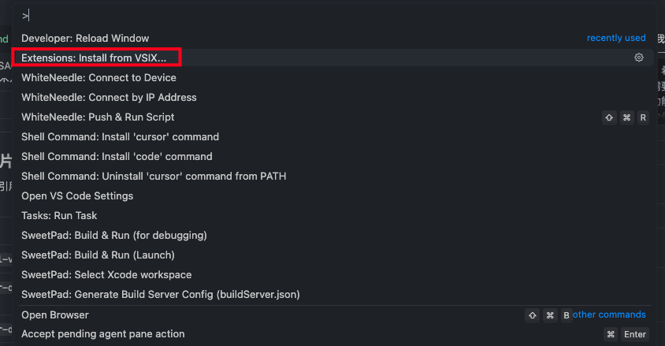

> **也可以用命令行安装：**
> ```bash
> # VS Code
> code --install-extension WhiteNeedle.vsix
> # Cursor
> cursor --install-extension WhiteNeedle.vsix
> ```

### 安装后你会看到

- 左侧 Activity Bar 多了一个 WhiteNeedle 图标
- 点击后展开侧边栏，包含 **Devices**、**Scripts** 和 **Installed Modules** 三个面板
- 底部状态栏出现连接状态指示

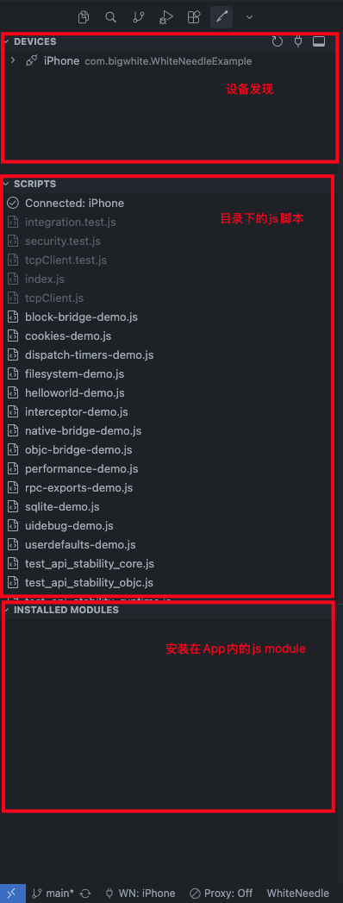

---

## 3. 集成 WhiteNeedle 到 App

WhiteNeedle 的核心是一个动态 Framework（`WhiteNeedle.framework`），需要加载到你想调试的 iOS App 中。有两种方式：

### 方式 A：重签名注入（推荐新手）

这种方式**不需要修改任何源代码**，只需要你有一个 `.ipa` 文件。

**你需要准备：**
- 一个 `.ipa` 文件（你的 App 的安装包）
- Apple 开发者证书（在钥匙串可以看到，名称类似 `Apple Development: xxx@xxx.com (XXXXXX)`）
- Provisioning Profile 描述文件（`.mobileprovision`，包含你的设备 UDID）

**操作步骤：**

```bash
# 1. 进入 resign 工具目录
cd dist/skills/whiteneedle-resign

# 2. 执行重签名（替换为你自己的路径和证书信息）
./bin/resign.sh \
  -i ~/Desktop/MyApp.ipa \
  -c "Apple Development: you@example.com (ABCDEF)" \
  -p ~/Desktop/MyProfile.mobileprovision

# 3. 签名成功后会输出新的 IPA 文件路径，类似：
#    ✅ Output: ~/Desktop/MyApp_whiteneedle.ipa

# 4. 安装到 iPhone
brew install ios-deploy  # 如果没安装过
ios-deploy --bundle ~/Desktop/MyApp_whiteneedle.ipa
```

> **Cursor 用户的更简单方式：** 如果你使用 Cursor 且已安装 `whiteneedle-resign` Skill，只需要在 Cursor 对话中说 `"帮我重签名这个 IPA: ~/Desktop/MyApp.ipa"`，AI 会自动引导你完成全部流程。

### 方式 B：CocoaPods 集成（团队推荐）

适合长期使用，需要修改 Xcode 工程。参见 [dist/README.md](../README.md) 中的详细步骤。

---

## 4. 连接设备

### 方式一：Bonjour 自动发现（推荐）

如果 App 的 `Info.plist` 正确配置了 Bonjour（重签名和 CocoaPods 集成均会自动配置），设备会自动出现在列表中。

**操作步骤：**

1. 在 iPhone 上打开集成了 WhiteNeedle 的 App
2. 在 VS Code / Cursor 中点击左侧 WhiteNeedle 图标
3. 在 **Devices** 面板中等待几秒，你的设备会自动出现
4. 点击设备名称即可连接

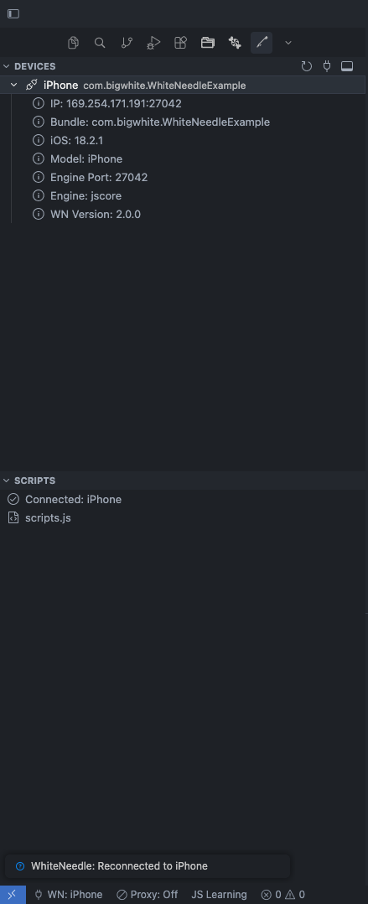

> **首次连接提示：**
> - iPhone 上可能弹出「是否允许 XXX 使用本地网络」的弹窗，请点击 **允许**
> - Mac 上如果弹出防火墙或本地网络权限提示，也请 **允许**

### 方式二：手动 IP 连接

如果设备没有自动出现，可以手动输入 IP 地址。

**先查看 iPhone 的 IP 地址：**

1. iPhone → **设置** → **Wi-Fi** → 点击当前连接的 Wi-Fi 名称右侧的 ⓘ
2. 找到 **IP 地址**，例如 `192.168.1.100`

**然后在 VS Code 中连接：**

1. 点击 Devices 面板标题栏的 🔌 图标（Connect by IP）
2. 输入 `192.168.1.100`（只填 IP，端口默认 27042）
3. 按回车，等待连接成功

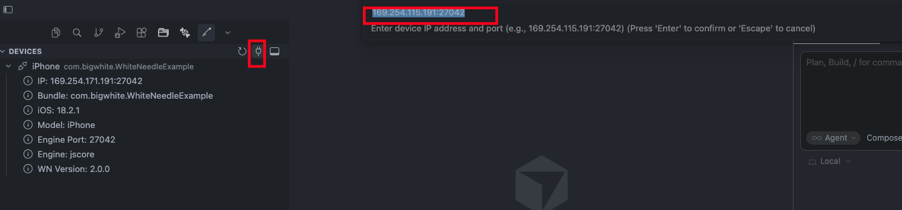

### 连接成功的标志

- Devices 面板中设备名称变为绿色/高亮状态
- 底部状态栏显示连接信息
- 从此刻起，你可以向设备推送脚本和使用所有面板功能

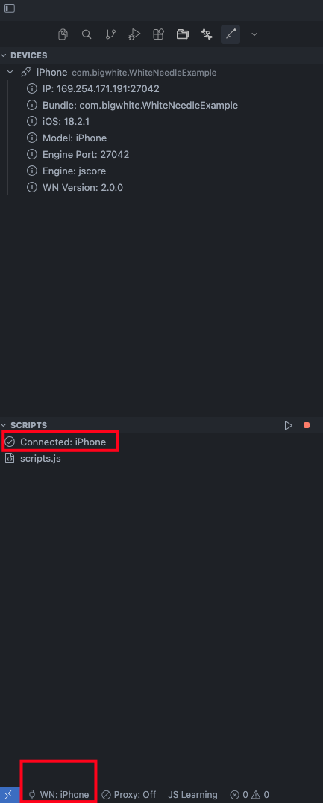

---

## 5. 编写与推送脚本

WhiteNeedle 允许你编写 JavaScript 脚本，在 iOS 设备上实时执行，用来 Hook 方法、读取数据、修改行为等。

### 创建新脚本

1. 按 `Cmd+Shift+P` 打开命令面板
2. 输入 `WhiteNeedle: New Script`
3. 会自动创建一个新文件，包含脚本模板和类型声明引用

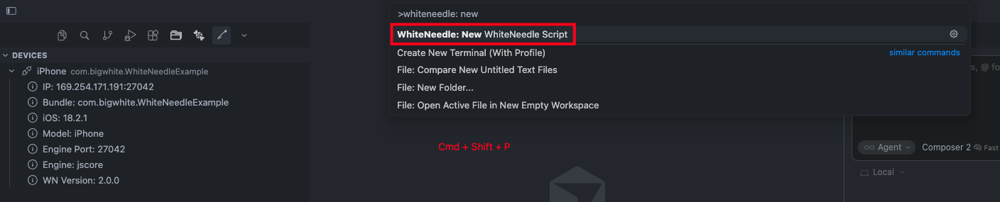

### 享受智能补全

由于扩展内置了完整的类型声明，你在编写脚本时会获得：

- API 名称自动补全（输入 `ObjC.` 会列出所有可用方法）
- 参数类型提示
- 内联文档注释

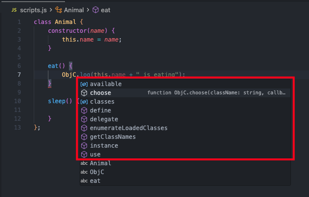

### 推送脚本到设备

有三种方式推送脚本到 iPhone 执行：

| 方式 | 操作 |
|------|------|
| 快捷键 | 在脚本编辑器中按 `Cmd+Shift+R` |
| 标题栏按钮 | 点击编辑器标题栏的 ▶️ 按钮 |
| 命令面板 | `Cmd+Shift+P` → `WhiteNeedle: Push & Run Script` |

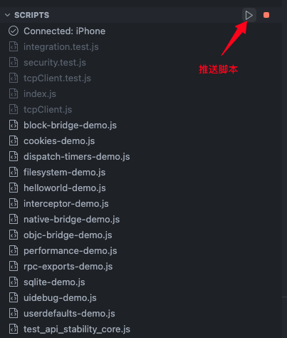

### 查看执行结果

脚本中的 `console.log()` 输出会显示在 VS Code 的 Output 面板中：

1. 菜单 **View → Output**（或 `Cmd+Shift+U`）
2. 在 Output 面板右上角的下拉列表中选择 **WhiteNeedle**
3. 即可看到脚本的实时输出

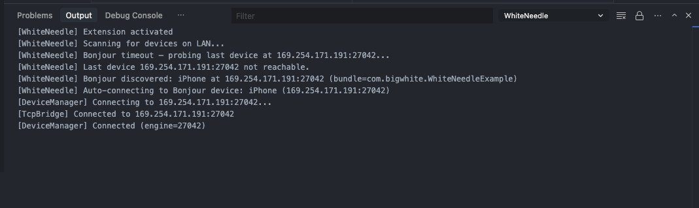

### 示例：你的第一个脚本

```javascript
// 获取当前 App 的 Bundle ID
var app = ObjC.use('NSBundle').invoke('mainBundle').invoke('bundleIdentifier');
console.log('当前 App Bundle ID:', app.toString());

// 获取当前屏幕上的 ViewController
var rootVC = ObjC.use('UIApplication')
    .invoke('sharedApplication')
    .invoke('keyWindow')
    .invoke('rootViewController');
console.log('根控制器:', rootVC.invoke('class').toString());
```

按 `Cmd+Shift+R` 推送，在 Output 面板查看结果。

> **保存自动重载：** 默认情况下，每次你保存脚本（`Cmd+S`），脚本会自动推送到设备重新执行。可以在设置中关闭：`whiteneedle.autoReload → false`。

---

## 6. 脚本执行模式（Single / Project）

WhiteNeedle 支持两种脚本执行模式，适用于不同的调试场景。你可以在 VS Code 设置中切换。

### 切换方式

1. 打开 VS Code 设置（`Cmd+,`）
2. 搜索 `whiteneedle.scriptMode`
3. 选择 `single`（默认）或 `project`

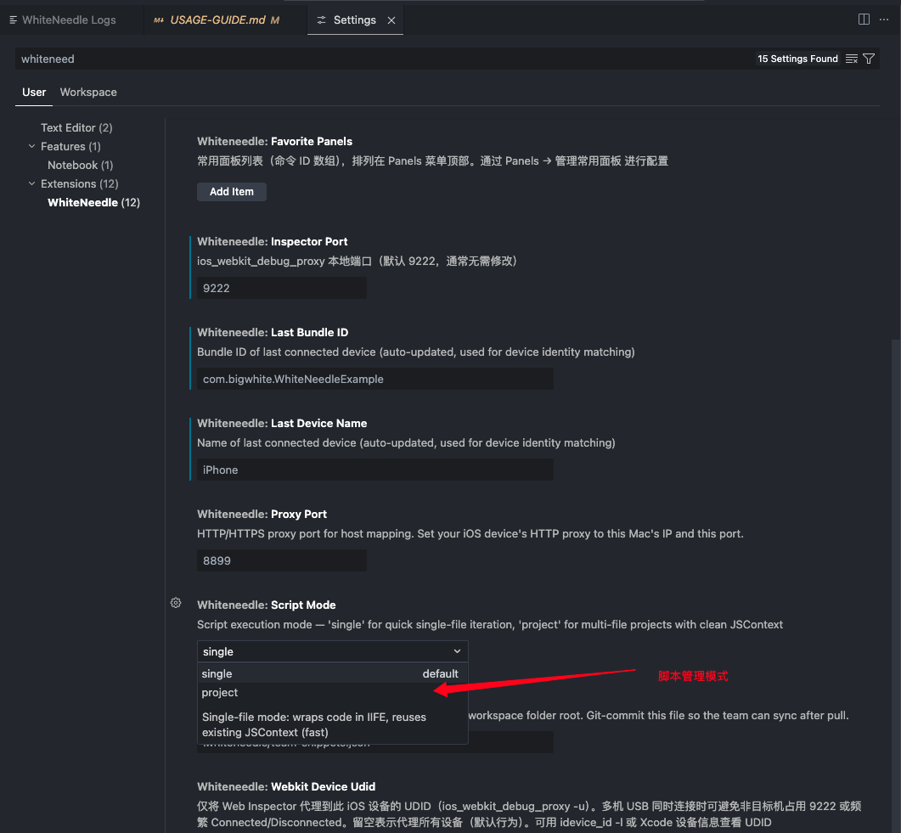

### Single 模式（默认）

**适合：** 快速单文件调试、简单脚本迭代

| 特性 | 说明 |
|------|------|
| 执行方式 | 脚本自动包裹在 IIFE 中执行，复用已有 JSContext |
| 速度 | 快，保存即刻生效 |
| 上下文 | 复用当前 JSContext（已有变量/Hook 不受影响） |
| 依赖处理 | 不做依赖分析 |

这是默认模式，适合大多数日常调试场景。你写一个 `.js` 文件，保存后立刻在设备端执行，无需关心上下文重置。

### Project 模式

**适合：** 多文件项目调试、需要干净环境的场景

| 特性 | 说明 |
|------|------|
| 执行方式 | 每次执行时创建全新的 JSContext |
| 速度 | 稍慢（需要重建 JSContext 和推送依赖） |
| 上下文 | 完全干净的环境（bootstrap.js 和所有 Bridge 会重新加载） |
| 依赖处理 | 自动分析 `require('./...')` 相对路径依赖并推送到设备 |
| Hook 恢复 | HookPanel 中设置的 Hook 会自动回放恢复 |

Project 模式的执行流程：

```
1. 分析主脚本中的 require('./...') 相对路径依赖
2. 重置 JSContext（清理 Hook、模块缓存、FPS 监控）
3. 重建 JSContext（加载 bootstrap.js、注册所有 Bridge）
4. 回放 Hook Manager 面板中设置的 Hook 代码
5. 将相对路径依赖推送到设备临时目录 (tmp/wn_run/)
6. 执行主脚本
```

### 何时切换到 Project 模式

- 你的脚本使用 `require('./helper.js')` 等方式引用了同目录下的其他 JS 文件
- 你需要每次执行时都从干净的环境开始（避免旧变量干扰）
- 你在做模块化的多文件项目调试

### 依赖解析规则

| require 形式 | 处理方式 |
|-------------|---------|
| `require('./math.js')` | ✅ 自动推送到设备（相对路径，视为本地依赖） |
| `require('../utils/helper')` | ✅ 自动推送到设备（相对路径） |
| `require('lodash')` | ❌ 不推送，假定已预装在设备端 `wn_modules` 或 `wn_installed_modules` 中 |

> **注意：** 裸模块名（如 `lodash`）需要提前安装到设备端。参见下一节「JS 模块管理」。

---

## 7. JS 模块管理

WhiteNeedle 支持将常用的 JS 模块预装到设备端，让你的脚本可以直接 `require('模块名')` 使用，无需每次从 Mac 推送。

### 安装后的位置

模块安装到设备沙盒的 `Documents/wn_installed_modules/` 目录中。WhiteNeedle 的模块加载器会按以下顺序搜索 `require()` 的模块：

```
1. Documents/wn_modules/        （内置模块）
2. Documents/wn_installed_modules/ （用户安装的模块）
3. Bundle/wn_modules/           （App 包内打包的模块）
4. tmp/wn_run/                  （Project 模式运行时推送的临时依赖）
```

### 查看已安装模块

连接设备后，在侧边栏的 **Installed Modules** 面板中可以看到已安装的模块列表：

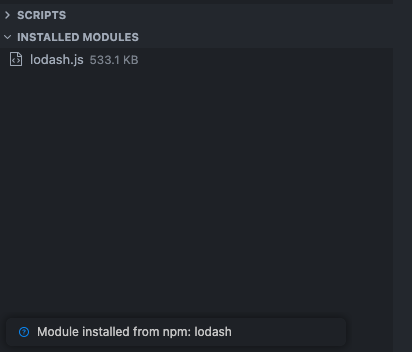

### 安装模块

点击 Installed Modules 面板标题栏的 ➕ 按钮（或 `Cmd+Shift+P` → `WhiteNeedle: Install JS Module`），会弹出安装来源选择：

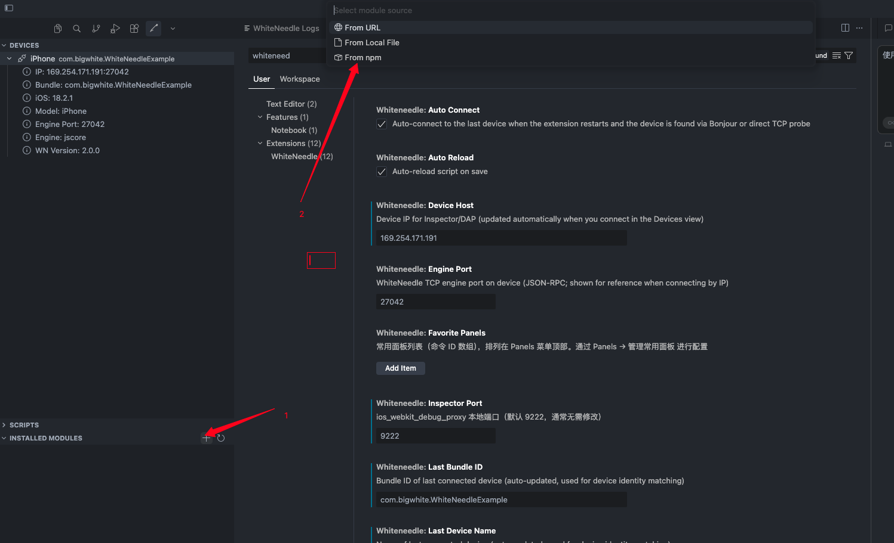

| 来源 | 说明 | 示例 |
|------|------|------|
| **From URL** | 直接从网络 URL 下载 JS 文件 | `https://unpkg.com/lodash/lodash.min.js` |
| **From Local File** | 选择 Mac 上的本地 JS 文件 | `~/libs/my-utils.js` |
| **From npm** | 通过 unpkg.com CDN 下载 npm 包的 UMD 单文件 bundle | `lodash`、`dayjs` |

#### 从 npm 安装

输入 npm 包名（如 `lodash`），扩展会自动从 `https://unpkg.com/<包名>` 下载文件。这种方式适合有 UMD/CJS 单文件 bundle 的包。

> **提示：** 不是所有 npm 包都提供单文件 bundle。如果下载内容不正确，可以手动找到正确的 CDN 链接后用「From URL」方式安装。

### 卸载模块

在 Installed Modules 面板中，右键点击模块名称，选择 **Uninstall Module**。

### 在脚本中使用已安装模块

安装后，直接在脚本中用 `require()` 引用模块名（不带路径前缀）：

```javascript
var _ = require('lodash.min');
var dayjs = require('dayjs');

console.log(_.chunk([1, 2, 3, 4, 5], 2));
console.log(dayjs().format('YYYY-MM-DD'));
```

> **模块名 = 文件名（不含 .js 后缀）**。例如安装了 `lodash.min.js`，则 `require('lodash.min')` 即可。

### 已安装模块在 Context 重置后仍然可用

即使在 Project 模式下重置了 JSContext，`wn_installed_modules` 路径会被自动恢复到搜索路径中，已安装的模块依然可用。

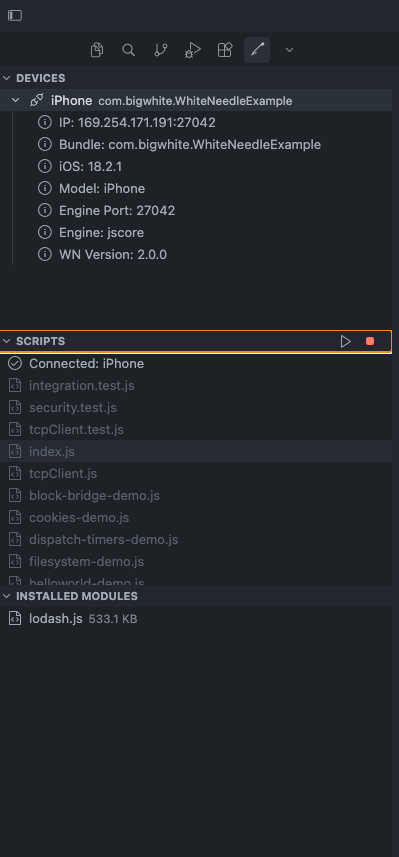

---

## 8. ObjC Runtime 浏览器

浏览 iOS App 中所有已加载的 Objective-C 类、方法和属性。

### 打开方式

点击 Devices 面板标题栏的面板菜单图标（≡），选择 **ObjC Runtime**。

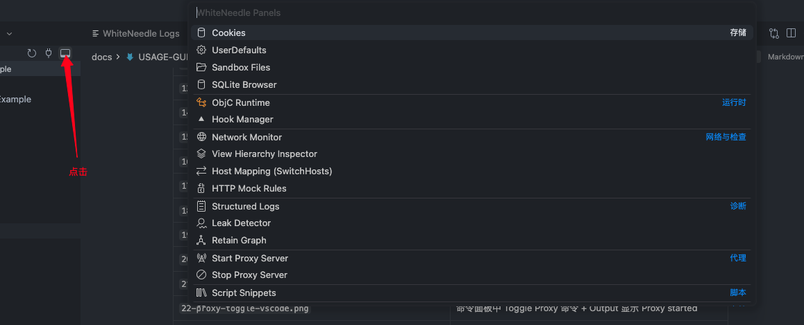

### 功能

- 搜索类名（支持模糊匹配）
- 展开类查看所有实例方法和类方法
- 查看方法签名（参数类型、返回值）
- 浏览类的属性列表和继承链

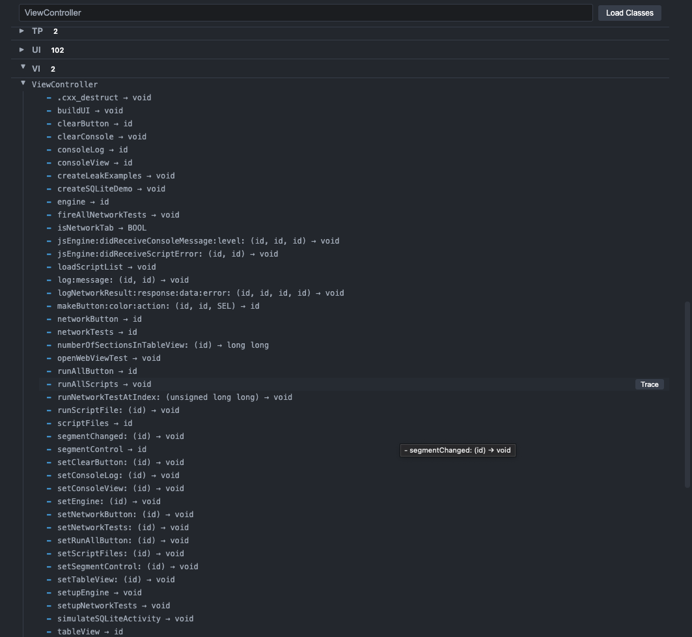

### 使用场景

- 不确定某个类有哪些方法时，可以直接搜索浏览
- 想知道某个 ViewController 有什么属性
- Hook 之前先确认方法签名

---

## 9. Hook Manager

可视化管理当前所有活跃的方法 Hook。

### 打开方式

面板菜单 → **Hook Manager**

### 功能

- 查看当前所有已激活的 Hook 列表
- 每个 Hook 显示目标类名、方法名、类型（进入/退出）
- 一键移除单个 Hook
- 批量清除所有 Hook

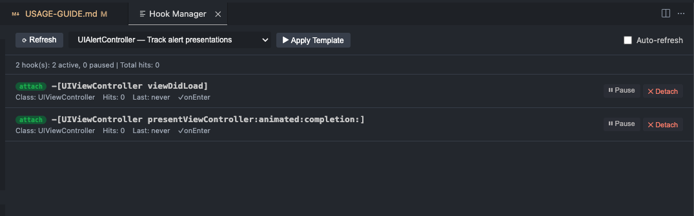

### 使用场景

- 调试时挂了很多 Hook，需要了解当前状态
- 某个 Hook 引起了问题，快速定位并移除
- 脚本中用 `Interceptor.attach()` 后在这里看到效果

---

## 10. View Hierarchy 视图层级

远程查看 iPhone 屏幕上当前的 UI 视图树。

### 打开方式

面板菜单 → **View Hierarchy Inspector**

### 功能

- 树形展示当前 UI 层级结构
- 每个视图显示类名、frame、是否隐藏
- 点击视图节点查看详细属性
- 搜索定位特定视图

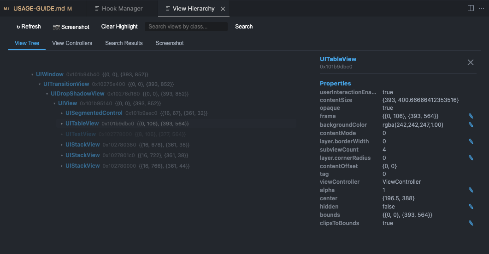

### 使用场景

- 想知道某个按钮/标签是什么类
- 查看布局问题（frame、hidden 状态）
- 定位要 Hook 的目标视图对应的 ViewController

---

## 11. Leak Detector 内存泄漏检测

检测 App 中可能存在的 ViewController 内存泄漏。

### 打开方式

面板菜单 → **Leak Detector**

### 功能

- 扫描当前已释放但仍被持有的 ViewController
- 列出疑似泄漏的对象及引用路径
- 帮助定位循环引用问题

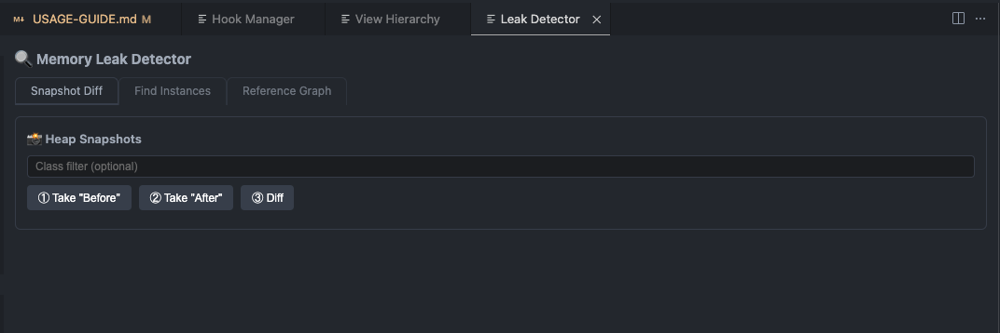

### 使用场景

- App 使用过程中内存持续增长
- 页面退出后 ViewController 没有正确释放（`dealloc` 未调用）

---

## 12. Retain Graph 循环引用图

以可视化图形展示对象之间的引用关系。

### 打开方式

面板菜单 → **Retain Graph**

### 功能

- 指定一个对象，生成其引用关系图
- 图形化展示强引用/弱引用链
- 高亮标记可能形成循环的引用路径
- 支持缩放和拖拽浏览

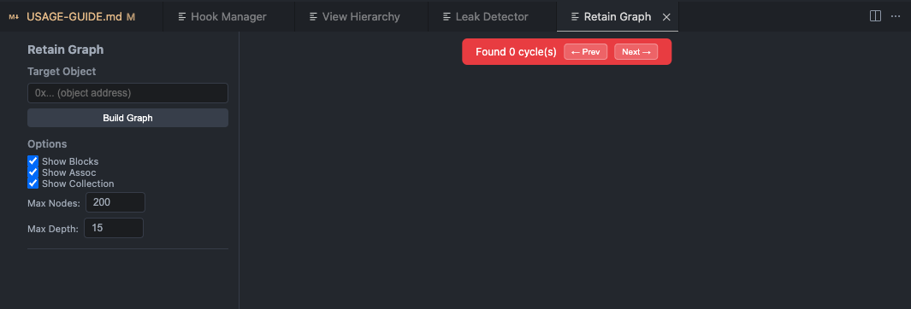

### 使用场景

- Leak Detector 发现泄漏后，进一步分析引用链
- 验证 weak/strong 引用设计是否正确

---

## 13. Cookies 查看器

查看和编辑 App 的 HTTP Cookie 存储。

### 打开方式

面板菜单 → **Cookies**

### 功能

- 列出所有 Cookie（域名、名称、值、过期时间）
- 搜索特定域名或 Cookie 名称
- 编辑 Cookie 的值
- 删除单个或全部 Cookie

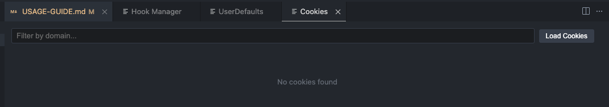

### 使用场景

- 查看登录态的 Session Cookie
- 修改 Cookie 值测试服务端行为
- 清除 Cookie 模拟未登录状态

---

## 14. UserDefaults 查看器

浏览和修改 App 的 `NSUserDefaults` 存储。

### 打开方式

面板菜单 → **UserDefaults**

### 功能

- 列出所有 UserDefaults 的键值对
- 显示值的类型（String / Number / Bool / Array / Dictionary）
- 编辑值
- 搜索特定的 Key

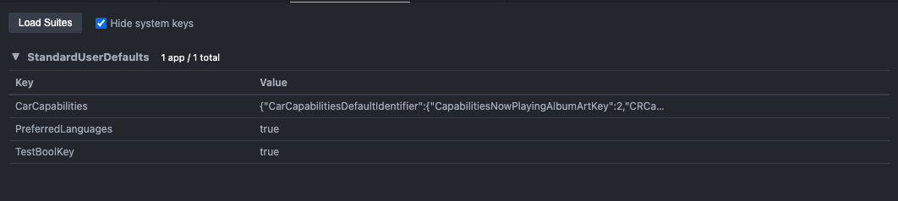

### 使用场景

- 查看 App 的功能开关配置
- 修改某个标志位测试不同分支逻辑
- 查看首次启动/引导页的状态

---

## 15. Sandbox Files 沙盒浏览

远程文件浏览器，查看 App 沙盒目录中的所有文件。

### 打开方式

面板菜单 → **Sandbox Files**

### 功能

- 树形展示 App 沙盒目录结构（Documents / Library / tmp）
- 查看文件大小和修改时间
- 预览文本文件内容
- 导航到数据库文件后可以跳转到 SQLite Browser 打开

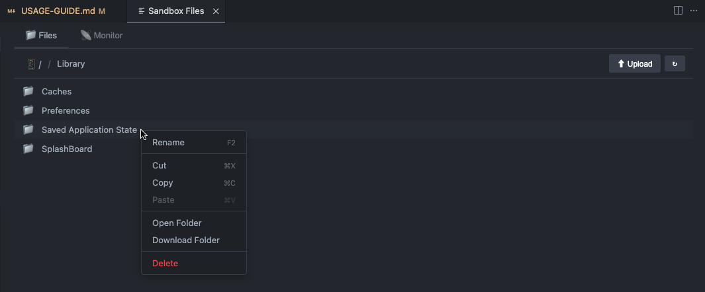

### 使用场景

- 查看 App 下载/缓存了哪些文件
- 定位日志文件的存储位置
- 找到 SQLite 数据库文件路径

---

## 16. SQLite Browser 数据库浏览

打开设备端的 SQLite 数据库文件，执行 SQL 查询。

### 打开方式

面板菜单 → **SQLite Browser**

### 功能

- 选择沙盒中的 `.db` / `.sqlite` 文件打开
- 浏览数据库中的所有表
- 执行任意 SQL 查询
- 结果以表格形式展示

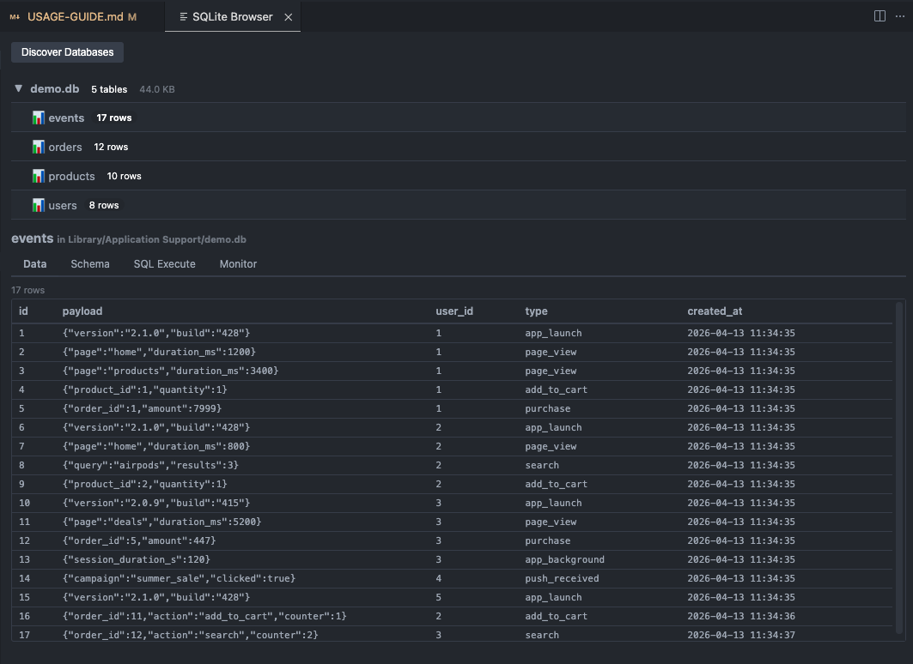

### 使用场景

- 查看 App 的本地数据库内容
- 验证数据写入是否正确
- 直接修改数据库记录测试 UI 展示

---

## 17. Network Monitor 网络监控

实时监控 App 发出的 HTTP/HTTPS 网络请求。

### 打开方式

面板菜单 → **Network Monitor**

### 功能

- 实时列表展示所有 HTTP/HTTPS 请求
- 每条请求显示方法（GET/POST）、URL、状态码、耗时
- 点击展开查看完整的请求头、请求体、响应头、响应体
- 搜索和过滤（按 URL、状态码等）

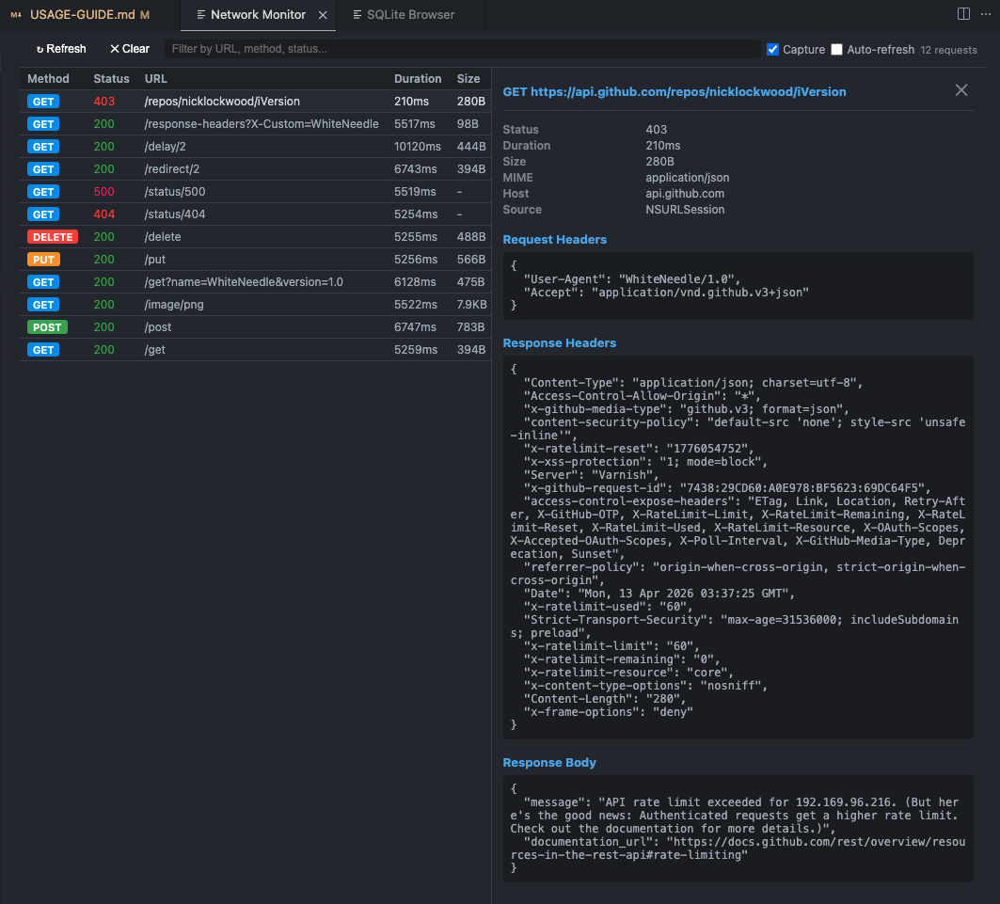

### 使用说明

Network Monitor 通过 Hook NSURLSession 实现，**连接设备后直接可用**，不需要配置代理。

1. 确保已连接设备（参见第 4 节）
2. 打开 Network Monitor 面板
3. 在 iPhone 上操作 App，触发网络请求
4. 请求会实时出现在面板中

> **与 Proxy 的区别：** Network Monitor 是无侵入式的监控（通过 Hook 实现），不需要设置代理。而 Host Mapping 和 Mock Rules 需要流量经过代理才能修改，因此需要额外配置（见第 19 节）。

---

## 18. HTTP Mock Rules 接口模拟

拦截特定的网络请求，返回自定义的 Mock 响应。

### 打开方式

面板菜单 → **HTTP Mock Rules**

### 功能

- 创建 URL 匹配规则（精确匹配 / 正则匹配 / 前缀匹配）
- 为每条规则配置自定义的响应（状态码、Headers、Body）
- 启用/禁用单条规则
- 规则实时生效，无需重启 App

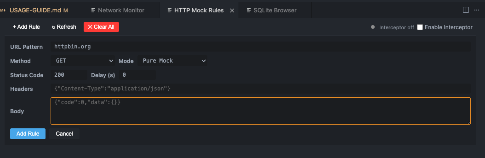

### 使用说明

Mock Rules **需要 Proxy 代理配合使用**。请先完成第 19 节的代理配置，然后再使用 Mock Rules。

### 使用场景

- 后端接口未完成时，Mock 返回数据继续前端开发
- 模拟各种错误状态（500、超时等）测试容错逻辑
- 固定返回数据做 UI 截图或录屏

---

## 19. Host Mapping 域名映射 + Proxy 代理

> ⚠️ **这是需要 Mac 和 iPhone 两端配合操作的功能。请严格按照以下步骤执行。**

Host Mapping 允许你将某个域名映射到不同的 IP（类似电脑上的 SwitchHosts 工具）。它需要通过内置的 Proxy 代理服务器实现。

### 工作原理

```
iPhone App 发出请求
       │
       ▼ (通过 Wi-Fi 代理)
┌──────────────────────────┐
│  Mac: WhiteNeedle Proxy  │  ← Host Mapping 规则在这里生效
│  (端口 8899)              │  ← Mock Rules 也在这里生效
└──────────────────────────┘
       │
       ▼ (转发到映射后的 IP)
     目标服务器
```

<!-- 图片待补充：代理工作流程示意图 -->

### 完整操作步骤

#### 第一步：在 Mac 上查看本机 IP

1. 打开 **系统设置 → Wi-Fi → 详细信息**
2. 记录 Mac 的 IP 地址，例如 `192.168.1.10`

#### 第二步：在 VS Code 中启动 Proxy

1. 按 `Cmd+Shift+P`，输入 `WhiteNeedle: Toggle Proxy Server`
2. 或者在面板菜单中点击 **Start Proxy Server**
3. 启动成功后，Output 面板会显示：`Proxy server started on port 8899`

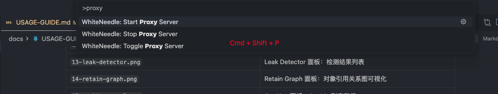

> **端口说明：** 默认代理端口是 `8899`，可以在设置中修改：`whiteneedle.proxyPort`

#### 第三步：在 iPhone 上配置 Wi-Fi 代理 ⚡️

> 这一步是在 **iPhone** 上操作，不是在 Mac 上。

1. 打开 iPhone **设置**
2. 点击 **Wi-Fi**
3. 点击当前连接的 Wi-Fi 名称右侧的 **ⓘ** 图标
4. 滚动到最底部，找到 **HTTP 代理** → 点击 **配置代理**
5. 选择 **手动**
6. 填写：
   - **服务器**：`192.168.1.10`（你的 Mac IP，第一步查到的）
   - **端口**：`8899`（与 VS Code 中启动的代理端口一致）
   - **鉴权**：关闭
7. 点击右上角 **存储**

<!-- 图片待补充：iPhone 设置 → Wi-Fi → HTTP 代理 → 手动配置界面截图 -->

#### 第四步：配置域名映射规则

1. 在 VS Code 面板菜单中打开 **Host Mapping (SwitchHosts)**
2. 添加映射规则，例如：
   - `api.example.com` → `192.168.1.50`（将线上 API 指向测试服务器）
   - `cdn.example.com` → `192.168.1.60`（将 CDN 指向本地服务器）
3. 确保规则处于 **启用** 状态

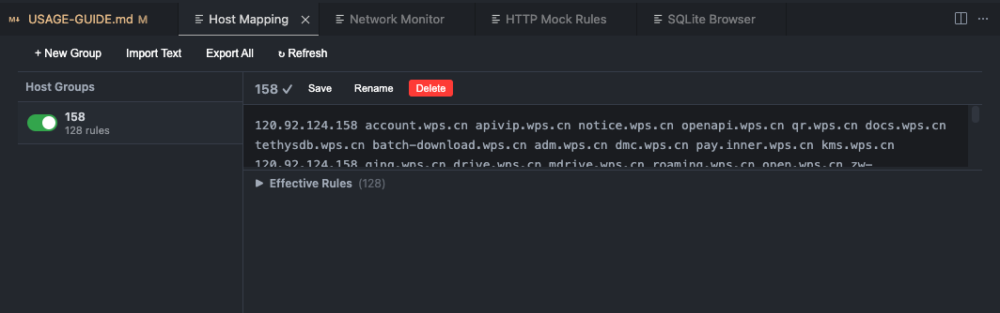

#### 第五步：验证

1. 在 iPhone 上使用 App
2. App 对 `api.example.com` 的请求会被代理转发到 `192.168.1.50`
3. 在 Network Monitor 中可以看到请求的实际转发情况

#### 使用完毕后的清理

> ⚠️ **重要：用完后务必恢复 iPhone 代理设置，否则 iPhone 将无法正常上网！**

1. iPhone **设置 → Wi-Fi → ⓘ → HTTP 代理 → 配置代理 → 关闭**
2. VS Code 中 `Cmd+Shift+P` → `WhiteNeedle: Toggle Proxy Server` 停止代理

### 使用场景

- 将生产环境的 API 域名映射到测试/预发布服务器
- 不修改 App 代码的情况下切换后端环境
- 配合 Mock Rules 拦截特定接口返回自定义数据

---

## 20. Script Snippets 脚本片段

内置的常用脚本代码片段库，帮助你快速编写常见操作。

### 打开方式

面板菜单 → **Script Snippets**

### 功能

- 按分类浏览代码片段（Hook、Runtime、UI、Network 等）
- 点击片段插入到当前编辑器
- 片段包含完整的示例代码和注释说明

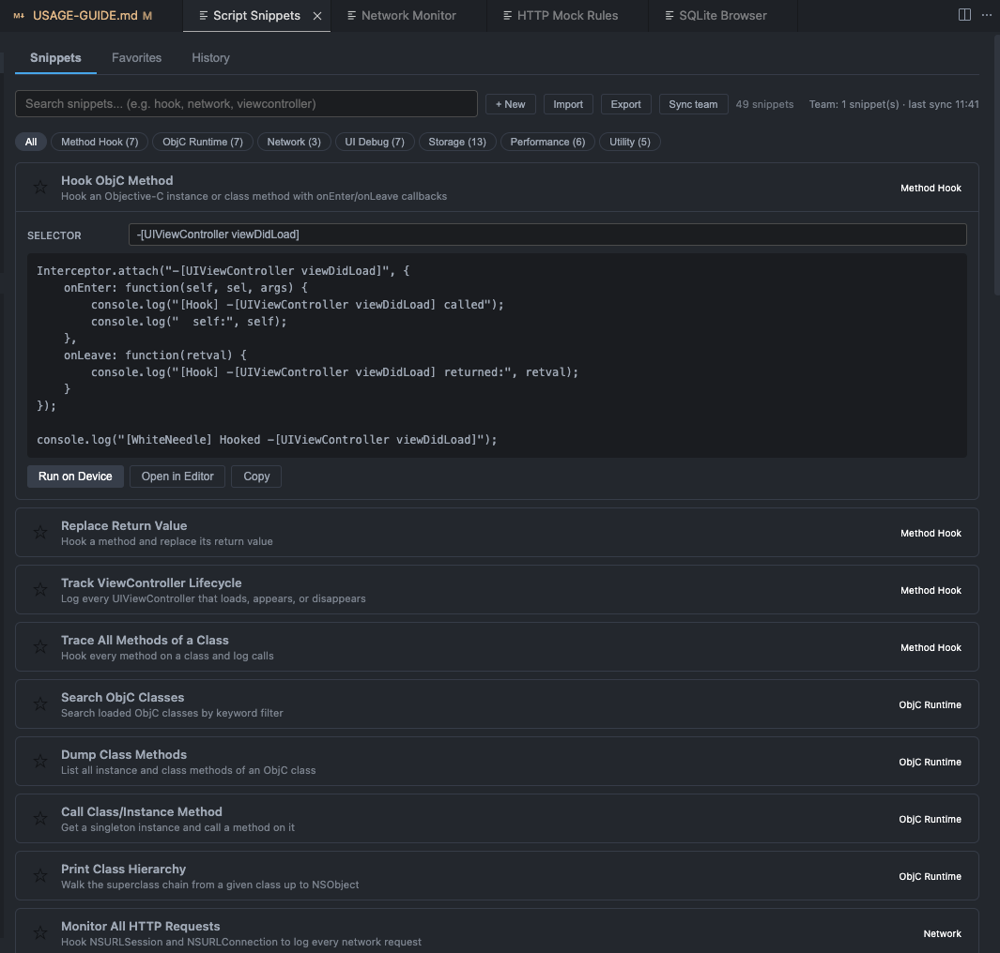

### 使用场景

- 新手不熟悉 API 时，从片段库中找到现成的示例
- 快速插入常用的 Hook 模板
- 作为编写自定义脚本的起点

---

## 21. Team Snippets 团队共享片段

团队成员可以共享自定义脚本片段，通过 Git 仓库同步。

### 配置方式

1. 在项目根目录下创建 `.whiteneedle/team-snippets.json`
2. 将该文件提交到 Git 仓库
3. 团队成员 pull 代码后，通过面板 → **Sync teams** 按钮同步

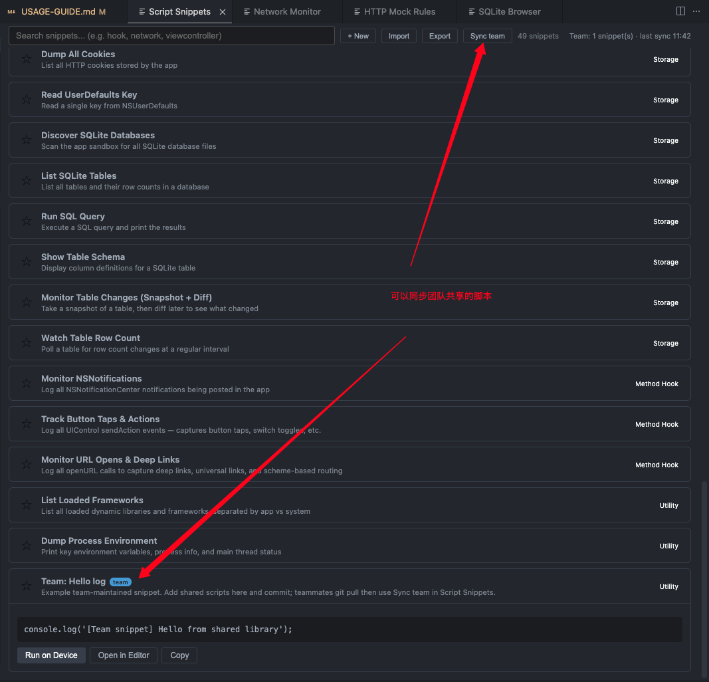

### 文件格式

```json
[
    {
        "name": "Hook 登录接口",
        "category": "Network",
        "code": "Interceptor.attach('-[LoginService login:]', {\n    onEnter: function(self) {\n        console.log('Login called');\n    }\n});"
    }
]
```

### 配置说明

团队片段文件的路径可以在设置中修改：

`whiteneedle.snippets.teamFile` — 默认值 `.whiteneedle/team-snippets.json`，相对于工作区根目录。

---

## 22. API Documentation 内置文档

扩展内置了完整的 WhiteNeedle JS API 文档，离线可用。

### 打开方式

面板菜单 → **API Documentation**

### 功能

- 按模块浏览所有 API（ObjC Bridge、Interceptor、FileSystem 等）
- 每个 API 有完整的参数说明和使用示例
- 支持搜索
- 不需要网络连接，完全本地

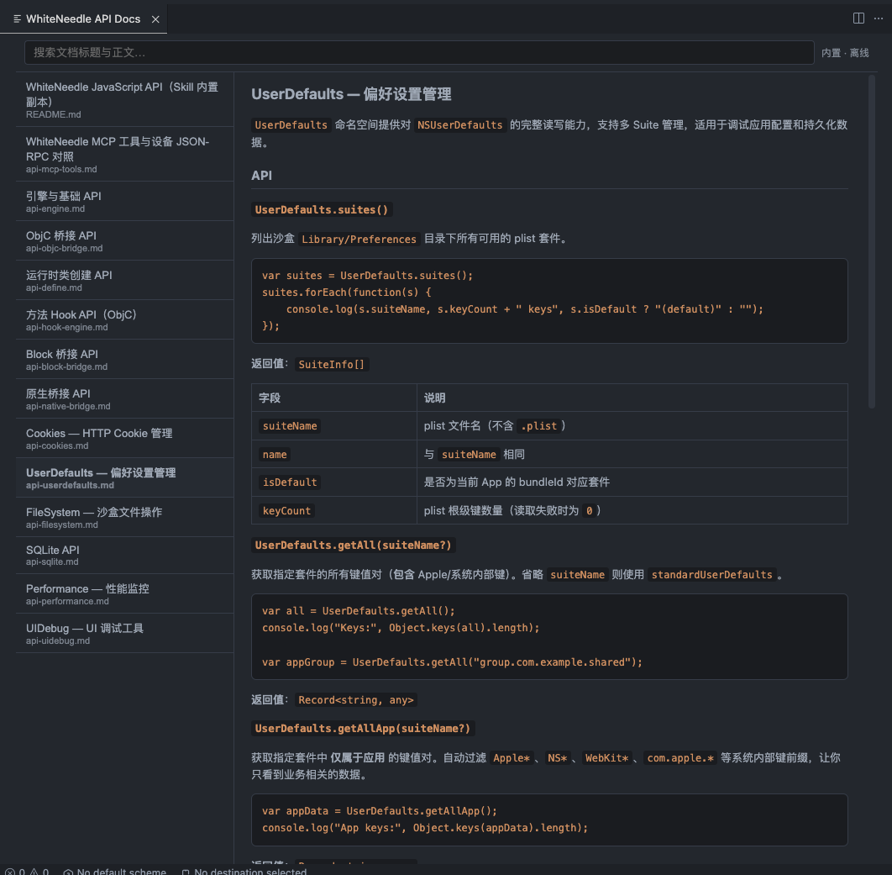

---

## 23. Structured Logs 结构化日志

格式化的设备端日志查看器，比 Output 面板提供更好的日志浏览体验。

### 打开方式

面板菜单 → **Structured Logs**

### 功能

- 按等级分类（Info / Warning / Error）
- 按时间排序
- 支持关键字过滤
- 彩色高亮不同等级的日志

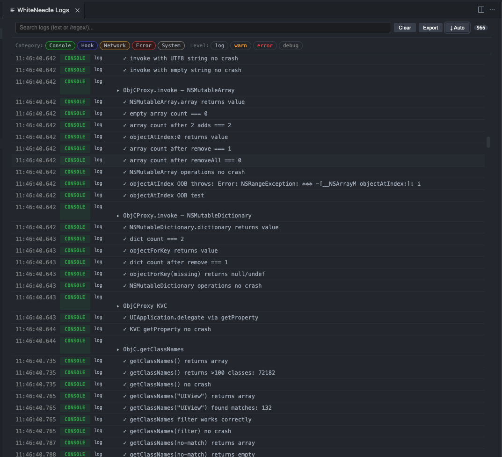

### 与 Output 面板的区别

| | Output 面板 | Structured Logs |
|---|---|---|
| 日志格式 | 纯文本 | 结构化表格 |
| 过滤 | 无 | 支持等级和关键字过滤 |
| 适合 | 快速查看 | 大量日志时的浏览和分析 |

---

## 24. DAP 断点调试

WhiteNeedle 支持通过 VS Code 的标准 Debug 功能进行 JavaScript 断点调试。

> 这是一个进阶功能，依赖 `ios_webkit_debug_proxy` 工具。

### 前置安装

```bash
# 安装 ios_webkit_debug_proxy
brew install ios-webkit-debug-proxy

# 安装 libimobiledevice（USB 通信支持）
brew install libimobiledevice
```

### 配置 launch.json

1. 在项目根目录创建（或打开） `.vscode/launch.json`
2. 添加以下配置：

```json
{
    "version": "0.2.0",
    "configurations": [
        {
            "type": "whiteneedle",
            "request": "launch",
            "name": "WhiteNeedle: Debug",
            "host": "127.0.0.1",
            "inspectorPort": 9222
        }
    ]
}
```

<!-- 图片待补充：.vscode/launch.json 中 WhiteNeedle Debug 配置截图 -->

### 调试步骤

1. 用 **USB 数据线** 将 iPhone 连接到 Mac（DAP 调试通过 USB 通信）
2. 确保 iPhone 上的 **设置 → Safari → 高级 → Web 检查器** 已开启
3. 先通过 `Push & Run` 推送脚本到设备
4. 在脚本中设置断点（点击行号左侧的红点）
5. 按 `F5` 启动调试或点击 Debug 面板的绿色三角
6. 当断点命中时，可以查看变量、调用栈，使用 Debug Console 执行表达式

<!-- 图片待补充：断点命中时的调试界面截图 -->

> **注意：** DAP 调试需要 USB 连接，而普通的脚本推送可以通过 Wi-Fi 完成。这是两个独立的通信通道。

---

## 25. MCP Server（AI Agent 集成）

WhiteNeedle 提供了一个 MCP（Model Context Protocol）Server，让 Cursor、Claude Code 等 AI Agent 能够直接与 iOS 设备交互——浏览类、执行脚本、管理 Hook、监控网络、操作视图等——无需手动操作 VS Code 面板。

### 工作原理

```
┌─────────────────┐   stdio    ┌─────────────────┐   TCP 27042   ┌──────────────┐
│  Cursor / Claude │ ◄────────► │  MCP Server     │ ◄───────────► │  iPhone App  │
│  (AI Agent)      │            │  (Node.js)      │               │  (WhiteNeedle│
└─────────────────┘            └─────────────────┘               │   framework) │
                                                                  └──────────────┘
```

AI Agent 通过 MCP 协议调用工具（如 `evaluate`、`list_classes`），MCP Server 将请求转换为 JSON-RPC 发送到设备端 `WNRemoteServer`，再将结果返回给 Agent。

### 配置步骤

#### 第一步：确认 Node.js 已安装

```bash
node --version  # 需要 18.0+
```

#### 第二步：构建 MCP Server

```bash
cd mcp-server
npm install
npm run build
```

构建产物为 `mcp-server/dist/index.js`。

#### 第三步：在 Cursor 中配置 MCP

在项目根目录创建 `.cursor/mcp.json`（或在全局 `~/.cursor/mcp.json` 中配置）：

```json
{
    "mcpServers": {
        "whiteneedle": {
            "command": "node",
            "args": ["/path/to/mcp-server/dist/index.js"],
            "env": {
                "WN_HOST": "192.168.1.100",
                "WN_PORT": "27042"
            }
        }
    }
}
```

> **环境变量说明：**
> - `WN_HOST`：iPhone 的 IP 地址。如果不设置，默认 `127.0.0.1`（适用于 USB 端口转发场景）
> - `WN_PORT`：WhiteNeedle 端口，默认 `27042`
>
> 你也可以不设置环境变量，让 Agent 使用 `connect` 工具动态连接到指定设备。

#### 第四步：验证

在 Cursor 的 AI 对话中输入类似的请求：

```
连接到我的 iPhone（192.168.1.100），列出所有包含 ViewController 的类
```

Agent 会自动调用 `connect` → `list_classes` 工具完成操作。

### 可用工具一览

MCP Server 提供了 **38 个工具**，覆盖 WhiteNeedle 的全部核心能力：

| 分类 | 工具 | 说明 |
|------|------|------|
| **连接** | `connect` / `disconnect` | 连接/断开 iOS 设备 |
| **脚本** | `evaluate` / `load_script` / `unload_script` / `list_scripts` | 执行 JS、管理命名脚本 |
| **ObjC 探索** | `list_classes` / `get_methods` / `list_modules` | 浏览运行时类、方法、动态库 |
| **Hook** | `list_hooks` / `list_hooks_detailed` / `pause_hook` / `resume_hook` | 查看和控制活跃的 Hook |
| **高级探索** | `trace_method` / `rpc_call` / `inspect_object` / `heap_search` | 方法追踪、堆搜索、对象检查 |
| **网络** | `list_network_requests` / `get_network_request` / `clear_network_requests` / `set_network_capture` | HTTP 请求监控 |
| **UI 调试** | `get_view_hierarchy` / `get_view_controllers` / `get_vc_detail` / `get_view_detail` / `set_view_property` / `highlight_view` / `clear_highlight` / `search_views` / `search_views_by_text` / `get_screenshot` | 视图层级、属性修改、按类名/文本搜索视图、截图 |
| **HTTP Mock** | `list_mock_rules` / `add_mock_rule` / `update_mock_rule` / `remove_mock_rule` / `remove_all_mock_rules` / `enable_mock_interceptor` / `disable_mock_interceptor` / `get_mock_interceptor_status` | 接口模拟 |
| **Context** | `reset_context` / `list_installed_modules` | 重置 JS 环境、查看已安装模块 |
| **沙盒文件** | `write_file` / `mkdir` / `remove_dir` | 读写设备沙盒文件 |

> **完整的工具参数和 RPC 对照表** 见 `docs/api-mcp-tools.md`。

### 典型 Agent 使用场景

| 场景 | Agent 会调用的工具 |
|------|-------------------|
| 「帮我看看当前页面是哪个 ViewController」 | `get_view_controllers` → `get_vc_detail` |
| 「Hook 一下登录接口，打印请求参数」 | `list_classes` → `get_methods` → `evaluate`（注入 Hook 代码） |
| 「分析网络请求，看哪个接口最慢」 | `list_network_requests` → `get_network_request` |
| 「Mock 掉支付接口，返回成功」 | `enable_mock_interceptor` → `add_mock_rule` |
| 「重置环境，然后运行测试脚本」 | `reset_context` → `load_script` |
| 「找到显示'登录'的按钮，改成'Sign In'」 | `search_views_by_text`（搜索"登录"）→ `set_view_property`（修改 text） |

### 与 VS Code 扩展的关系

MCP Server 和 VS Code 扩展**共享同一个设备端引擎**（`WNRemoteServer`），可以同时使用：

- 用 VS Code 面板做可视化操作
- 用 AI Agent 做自动化批量操作
- 两者的操作互相可见（如 Agent 添加的 Hook 在 VS Code Hook Manager 中也能看到）

---

## 26. 常见问题与排查

### 设备列表空白 / 找不到设备

| 检查项 | 解决方式 |
|--------|---------|
| Mac 和 iPhone 不在同一 Wi-Fi | 确认连的是同一个路由器 |
| App 未运行 | 在 iPhone 上启动集成了 WhiteNeedle 的 App |
| Info.plist 缺少 Bonjour 配置 | 重签名和 CocoaPods 集成均会自动注入；如仍缺失请检查 Build Phases 中是否存在 `[WhiteNeedle] Inject Network Permissions` 脚本 |
| iPhone 未授权本地网络 | 设置 → 隐私与安全性 → 本地网络 → 找到 App 并开启 |
| Mac 防火墙阻止 | 系统设置 → 防火墙 → 选项 → 允许传入连接 |
| 以上都确认了仍然不行 | 使用 **Connect by IP** 手动连接 |

### 脚本推送后没有反应

| 检查项 | 解决方式 |
|--------|---------|
| 未连接设备 | 先在 Devices 面板连接设备 |
| 脚本有语法错误 | 查看 Output → WhiteNeedle 面板中的报错信息 |
| App 已切到后台 | 将 App 切到前台，iOS 后台可能暂停了 JSCore |

### 代理不生效（Host Mapping / Mock）

| 检查项 | 解决方式 |
|--------|---------|
| Proxy 未启动 | `Cmd+Shift+P` → `Toggle Proxy Server`，查看 Output 确认 `started on port 8899` |
| iPhone 代理未配置 | 设置 → Wi-Fi → ⓘ → HTTP 代理 → 手动 → 填写 Mac IP 和端口 |
| iPhone 代理填错 IP | 必须填 **Mac 的 IP**，不是 iPhone 的 IP |
| iPhone 代理填错端口 | 端口必须与 VS Code 中 Proxy 启动的端口一致（默认 8899） |
| 配好后完全无法上网 | Mac IP 或端口不对，或 Mac 端 Proxy 没有启动 |

### 代码补全不工作

| 检查项 | 解决方式 |
|--------|---------|
| 刚安装扩展 | 重新加载窗口：`Cmd+Shift+P` → `Reload Window` |
| 非 .js 文件 | 类型补全只对 JavaScript 文件生效 |
| jsconfig.json 异常 | 删除工作区根目录的 `jsconfig.json`，重新加载窗口让扩展重新创建 |

### DAP 调试连不上

| 检查项 | 解决方式 |
|--------|---------|
| 未用 USB 连接 | DAP 调试需要 USB 线连接 Mac 和 iPhone |
| ios_webkit_debug_proxy 未安装 | `brew install ios-webkit-debug-proxy` |
| Web 检查器未开启 | iPhone 设置 → Safari → 高级 → Web 检查器 → 开启 |
| 端口被占用 | 确认 9222 端口未被其他程序占用：`lsof -i :9222` |

### Project 模式 / 模块管理问题

| 检查项 | 解决方式 |
|--------|---------|
| Project 模式切换后没有效果 | 确认设置中 `whiteneedle.scriptMode` 已改为 `project`，然后点击 **Push & Run** 执行 |
| 相对路径依赖推送失败 | 确认依赖文件存在于 Mac 端，且路径拼写正确（`require('./math')` 会尝试找 `math.js`） |
| `require('xxx')` 报模块找不到 | 裸模块名需要预先安装到设备端（侧边栏 Installed Modules 面板 → ➕ 安装），或放在 `wn_modules` 目录中 |
| 安装模块后 require 仍然找不到 | 模块名 = 文件名（不含 `.js`），确认文件名匹配；如果是 Context 刚重置，搜索路径会自动恢复 |
| npm 安装下载的文件内容不对 | 该包可能没有 UMD 单文件 bundle，手动从 CDN 找到正确 URL 后用「From URL」安装 |
| Hook 在 Project 模式切换后丢失 | Hook Manager 面板中设置的 Hook 会自动回放恢复；脚本中手动写的 Hook 需要包含在主脚本中 |

---

## 附录：图片清单

以下是本指南引用的所有截图。请按照文件名到对应功能页面截取真实截图，替换 `docs/guide-images/` 目录中的占位文件：

| 文件名 | 截图内容说明 |
|--------|-------------|
| `01-install-vsix.png` | VS Code 命令面板中执行 Install from VSIX 的画面 |
| `02-sidebar-overview.png` | 安装扩展后左侧 Activity Bar 和侧边栏 Devices / Scripts / Installed Modules 面板的整体截图 |
| `03-bonjour-devices.png` | Devices 面板中出现了自动发现的设备列表 |
| `04-connect-by-ip.png` | 点击 Connect by IP 后弹出的输入框 |
| `05-device-connected-statusbar.png` | 连接成功后底部状态栏的连接状态显示 |
| `06-new-script-command.png` | 命令面板中输入 New Script 的画面 |
| `07-script-autocomplete.png` | 编辑器中输入 `ObjC.` 后弹出的自动补全列表 |
| `08-push-run-button.png` | 编辑器标题栏的 ▶️ Play 按钮和 ⏹ Stop 按钮 |
| `09-output-log.png` | Output 面板选中 WhiteNeedle 后显示的脚本执行日志 |
| `10-objc-runtime.png` | ObjC Runtime 面板：类列表、方法列表展开 |
| `11-hook-manager.png` | Hook Manager 面板：活跃的 Hook 列表 |
| `12-view-hierarchy.png` | View Hierarchy 面板：UI 树形结构 |
| `13-leak-detector.png` | Leak Detector 面板：检测结果列表 |
| `14-retain-graph.png` | Retain Graph 面板：对象引用关系图可视化 |
| `15-cookies-panel.png` | Cookies 面板：Cookie 列表和值 |
| `16-userdefaults-panel.png` | UserDefaults 面板：键值对列表 |
| `17-sandbox-files.png` | Sandbox Files 面板：沙盒目录树 |
| `18-sqlite-browser.png` | SQLite Browser 面板：表列表 + SQL 查询结果 |
| `19-network-monitor.png` | Network Monitor 面板：请求列表（URL、状态码、耗时）|
| `20-mock-rules.png` | Mock Rules 面板：规则列表和编辑界面 |
| `21-host-mapping.png` | Host Mapping 面板：域名映射规则列表 |
| `22-proxy-toggle-vscode.png` | 命令面板中 Toggle Proxy 命令 + Output 显示 Proxy started |
| `23-iphone-wifi-proxy-settings.png` | ⏳ **待补充** — iPhone 设置 → Wi-Fi → HTTP 代理 → 手动配置的截图 |
| `24-proxy-workflow-diagram.png` | ⏳ **待补充** — 代理工作流程示意图（可用绘图工具制作） |
| `25-snippet-library.png` | Script Snippets 面板：分类和代码片段列表 |
| `26-team-snippets-sync.png` | Sync Team Snippets 命令执行或面板提示 |
| `27-api-docs-panel.png` | API Documentation 面板：模块列表和 API 详情 |
| `28-structured-logs.png` | Structured Logs 面板：日志等级过滤和列表 |
| `29-dap-launch-json.png` | ⏳ **待补充** — .vscode/launch.json 中 WhiteNeedle Debug 配置 |
| `30-dap-breakpoint-hit.png` | ⏳ **待补充** — 断点命中时的调试界面（变量面板、调用栈、Debug Console） |
| `31-panels-menu.png` | Devices 面板标题栏展开的面板菜单（Panels 子菜单） |
| `32-script-mode-setting.png` | VS Code 设置中 `whiteneedle.scriptMode` 的下拉选择（single / project） |
| `33-module-tree-view.png` | 侧边栏 Installed Modules 面板中已安装模块列表 |
| `34-install-module-dialog.png` | Install JS Module 命令弹出的安装来源 Quick Pick（URL / File / npm） |
| `35-sidebar-with-modules.png` | 更新后的侧边栏全景：Devices + Scripts + Installed Modules 三个面板 |
